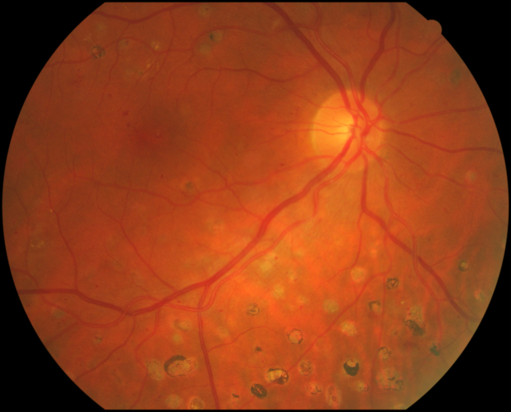

# G1020 segmentation mask generator
 G1020 segmentation masks generator

This repository contains a file to read json files of G1020 dataset and generate the correspoding image masks including disc and cup.

G1020: fundus Glaucoma dataset 
https://arxiv.org/abs/2006.09158

Install the requirements (tested with python 3.6).  
Specify the _in_dir_ and _out_dir_ in the main.py file. consider the provided sample folders. 
and then  
> python main.py

## Resource: 
This code is based on labelme package:
https://github.com/wkentaro/labelme

## Citation 

If you found this repository helpful for your project, please cite one of the following reports:  
- https://iovs.arvojournals.org/article.aspx?articleid=2791240 
Eslami, M., Motati, L.S., Kalahasty, R., Hashemabad, S.K., Shi, M., Luo, Y., Tian, Y., Zebardast, N., Wang, M. and Elze, T., 2023. Deep Learning based Adversarial Disturbances in Fundus Image Analysis. Investigative Ophthalmology & Visual Science, 64(9), pp.PB002-PB002.  
- https://iovs.arvojournals.org/article.aspx?articleid=2791086 
Motati, L.S., Kalahasty, R., Hashemabad, S.K., Shi, M., Luo, Y., Tian, Y., Zebardast, N., Wang, M., Elze, T. and Eslami, M., 2023. Evaluation of Robustness of Disc/Cup Segmentation in Different Fundus Imaging Conditions. Investigative Ophthalmology & Visual Science, 64(8), pp.1129-1129.  

And of course, you need to cite the original G1020 dataset as well:  
https://arxiv.org/abs/2006.09158

